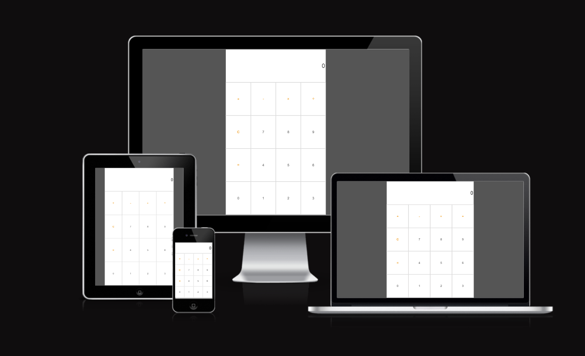

# Calculator Application 

 

[View the live site here](https://olena1788.github.io/calculator-project/)
 
 

# Table of Contents
1. [Introduction](#introduction)
    i. [Aims](#aims)
2. [User Experience](#user-experience-ux)
    1. [User Stories](#user-stories)
3. [Main Features](#main-features)
    1. [Wireframes](#wireframes)
    2. [User Interactivity](#user-interactivity)
    3. [Future Developments](#future-developments)
4. [Technologies](#technologies)
5. [Testing](#testing)
    1. [Manual Testing](#manual-testing)
    2. [Code Validation](#code-validation)
    3. [Lighthouse Score](#lighthouse-score)
    4. [Tools](#tools)
    5. [Browser Compatibility](#browser-compatibility)
    6. [Device Compatibility](#device-compatibility)
6. [Deployment](#deployment)
    1. [GitHub](#github)
    2. [Forking](#forking)
    3. [Cloning](#cloning)
7. [References & Acknowledgements](#references--acknowledgements)
   1.. [References](#references)
   2.. [Acknoledgements](#acknoledgements)
 
 

# Introduction & Aims
 The application provides a standard calculator functionality and was created to utilise the language of JavaScript. 
 
 
This application is for educational purposes.

## Aims
- To create application with HTML structure, CSS styling, and JavaScript interactivity
- To utilise functional and simple design concepts for an easy-to-navigate UX
- To create responsive design for accessibility on all devices
- To use application for quick and easy calculations
 
 

# User Experience
## User Stories
### As a first time visitor, I want to:
-  be able to easily make mathematical calculations
-  delete a mistyped digit easily
 

### As a returning visitor, I want to:
- be able to explore a scientific functionality of the application
- have an indication of the operations’ history
- be able to save a calculation with a name and view or edit it later
- be able to change it to dark mode 
 
 
 

# Main Features
## Design
Basic calculator design was utilised to create the application
 
 

## Wireframes
 

[Balsamiq](https://balsamiq.cloud/) has been used to create a wireframe to demonstrate the application.

 
 

## Features

 

The main screen of a basic calculator that can do only addition, subtraction, multiplication and division calculations. Addition, subtraction, multiplication, division, clear and equals buttons differ in colour to the numbers buttons.

 
 

## User Interactivity
### Buttons

 

All the buttons are clickable and hoverable.
 
 

## Future Developments
The given application has a significant developmental potential in features and functionality. 
In particular:
- addition of a scientific functionality to the application
- operations’ history to be displayed
- possibility to save a calculation with a name and view or edit it later
- possibility to use dark mode or night light (use warmer colours to help blocj blue light) 
- addition of unit conversion
 
 

