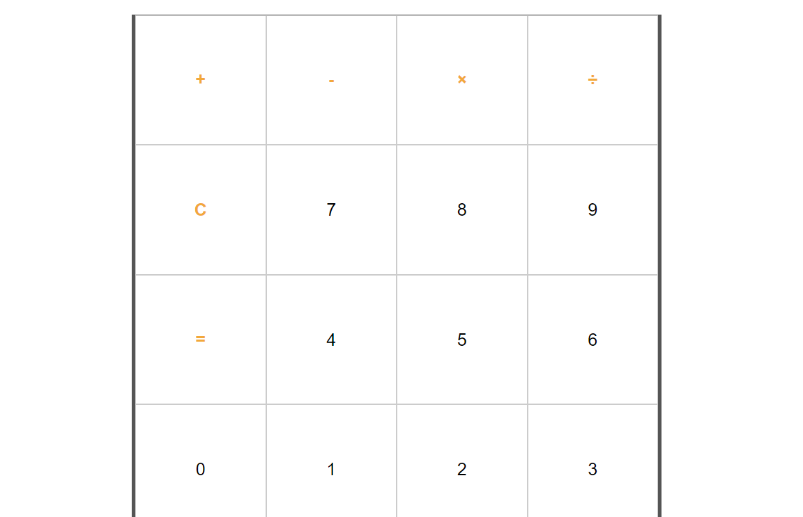

# Calculator Application 

 

[View the live site here](https://olena1788.github.io/calculator-project/)
 
 

# Table of Contents
1. [Introduction](#introduction)
    i. [Aims](#aims)
2. [User Experience](#user-experience-ux)
    1. [User Stories](#user-stories)
3. [Features](#main-features)
    1. [Wireframes](#wireframes)
    2. [User Interactivity](#user-interactivity)
    3. [Future Developments](#future-developments)
4. [Technologies](#technologies)
5. [Testing](#testing)
    1. [Manual Testing](#manual-testing)
    2. [Code Validation](#code-validation)
    3. [Lighthouse Score](#lighthouse-score)
    4. [Tools](#tools)
    5. [Browser Compatibility](#browser-compatibility)
    6. [Device Compatibility](#device-compatibility)
6. [Deployment](#deployment)
    1. [GitHub](#github)
    2. [Forking](#forking)
    3. [Cloning](#cloning)
7. [Acknowledgements](acknowledgements)
  
 
 

# Introduction & Aims
 The application provides a standard calculator functionality and was created to utilise the language of JavaScript. 
 
 
The application is for educational purposes.

## Aims
- To create application with HTML structure, CSS styling, and JavaScript interactivity
- To create responsive design for accessibility on all devices
- To use application for quick and easy calculations
 
 
# User Experience
## User Stories
### As a first time visitor, I want to:
-  be able to easily make mathematical calculations
-  delete a mistyped digit easily
 

### As a returning visitor, I want to:
- be able to explore a scientific functionality of the application
- have an indication of the operations’ history
- be able to save a calculation with a name and view or edit it later
- be able to change it to dark mode 
 
 

# Features
## Design
Basic calculator design was utilised to create the application
 
 

## Wireframes
 

[Balsamiq](https://balsamiq.cloud/) has been used to create a wireframe to demonstrate the application.

 
 

## Features

 

The main screen of a basic calculator that can do only addition, subtraction, multiplication and division calculations. Addition, subtraction, multiplication, division, clear and equals buttons differ in colour to the numbers buttons.

 
 

## User Interactivity
### Buttons

 

All the buttons are clickable and hoverable. The buttons act as intended. On click the number or the calculated result appears on the screen. No mistakes have been found in calculated results of numerous calculations when adding, subtracting, multiplying or dividing.
 
 

## Future Developments
The given application has a significant developmental potential in features and functionality. 
In particular:
- addition of a scientific functionality to the application
- operations’ history to be displayed
- possibility to save a calculation with a name and view or edit it later
- possibility to use dark mode
- addition of unit conversion
 
 

# Technologies
Languages used in this site are [HTML5](https://en.wikipedia.org/wiki/HTML5), [CSS3](https://en.wikipedia.org/wiki/CSS#CSS_3) and [JavaScript](https://en.wikipedia.org/wiki/JavaScript).

Other technologies include: 
- [Chrome DevTools](https://developer.chrome.com/docs/devtools/)
   - Debugging and testing responsiveness during development
- [JSHint](https://jshint.com/)
    - Code checking and debugging
- [GitHub](https://github.com/)
  - Site repository
- [Gitpod](https://gitpod.io/)
  - Online IDE for all coding work and site file management, terminal was used to add, commit, and push to Github
- [Responsive Design Checker](https://www.responsivedesignchecker.com/)
- [live.Browserstack](https://live.browserstack.com/)
 
 

# Testing
## Manual Testing 

**User and Design Expectation**
- The buttons are clearly designed for their purpose.
 

**Testing** 
 - The buttons act as intended. On click the number or the calculated result appears on the screen. 
  

### Responsiveness
**User and Design Expectation**
- To be able to use the calculator on any device and screen size
- For the site to maintain its structural design in different screen sizes
 

**Testing**
- Chrome Dev Tools was the primary tool for testing responsiveness throughout the development
- Responsiveness was additionally tested in Safari, Firefox, and Edge browers, and using [Am I Responsive](https://ui.dev/amiresponsive), the [Responsive Design Checker](https://www.responsivedesignchecker.com/) and [live.Browserstack](https://live.browserstack.com/)

 

## Code Validation
This site has been passed through the following code validation sites with no errors or warnings:
- [W3C HTML Validator Results](assets/images/html-report.png)
 

- [W3C CSS Validator Results](assets/images/css-report.png)
 

- [JSHint Java Script Code Quality Tool https://jshint.com/](assets/images/jshint-report.png)

 

## Lighthouse Score
[Google Dev Tools Lighthouse](https://chrome.google.com/webstore/detail/lighthouse/blipmdconlkpinefehnmjammfjpmpbjk?hl=en) tool was used to check site performance.

[Lighthouse desctop report](assets/images/lighthouse-desktop-report.png)

[Lighthouse mobile report](assets/images/lighthouse-mobile-report.png)
 

## Tools
[Google Dev Tools](https://developer.chrome.com/docs/devtools/) was used during the development process to test site responsiveness, design, and functionality.
 
 

## Browser Compatibility
Device | Outcome | Pass/Fail
--- | --- | ---
[Google Chrome](https://www.google.com/intl/en_uk/chrome/) | No appearance, responsiveness nor functionality issues. | Pass
[Firefox](https://www.mozilla.org/en-GB/firefox/)| No appearance, responsiveness nor functionality issues. | Pass
[Safari](https://safari.en.softonic.com/mac)| No appearance, responsiveness nor functionality issues. | Pass
[Edge](https://www.microsoft.com/en-us/edge)| No appearance, responsiveness nor functionality issues. | Pass

## Device Compatibility
Device | Outcome | Pass/Fail
--- | --- | ---
Samsung Galaxy 21 | No appearance, responsiveness nor functionality issues | Pass
iMac 21.5"| No appearance, responsiveness nor functionality issues | Pass
iPad Pro 10.5" | No appearance, responsiveness nor functionality issues | Pass
iPhone 11 | No appearance, responsiveness nor functionality issues | Pass
 
 

# Deployment
The live site can be accessed [here](https://olena1788.github.io/calculator-project/)
 
 

## GitHub
This project was deloyed to GitHub Pages with the following steps:
1. Log in to GitHub (create an account if necessary)
2. Locate the [GitHub Respository](https://github.com/Olena1788/calculator-project)
3. On the repository page, find the 'Settings' icon anc click on it
4. In the Settings page, look for and click the 'Pages' menu item on the left hand side
5. In the 'Pages' page, under 'Source', select 'Branch:main', then '/root' and click save

 
 

## Forking
The fork this repository:
1. Log it to GitHub
2. Locate the [GitHub Respository](https://github.com/Olena1788/calculator-project)
3. On the repository page, find the 'Fork' menu in the top right, click on the small down arrow
4. Select '+ Create a new fork'
5. Remane repository as required
6. Click 'Create Fork'

 
 

## Cloning
To clone the repository:
1. Log in to GitHub
2. Locate the [GitHub Respository](https://github.com/Olena1788/calculator-project)
3. On the repository page, find and click on the 'Code' menu in the mid-top right of the page
4. Choose to either download or open in GitHub Desktop
  or
    5. Choose the HTTPS option and copy the URL to your clipboard
    6. - To clone the repository using HTTPS, under "HTTPS", copy the url
       - To clone the repository using an SSH key, including a certificate issued by your organization's SSH certificate authority, click SSH, then copy the url
       - To clone a repository using GitHub CLI, click GitHub CLI, then copy url
    7. Open Terminal and change the current directory to where you want the cloned directory
    8. Type git clone, and paste the url, press Enter to create your local clone
 
 

## Acknoledgements
Gratitude goes to the tutors at Code Institute and slack community for their guidance and assistance with my learning and developing JavaScript skills.
